# 实验3：中断、时钟与Shell实现实验报告

## 1. 软件框图及概述

### 软件框图

```mermaid
graph TD
    A[硬件层] --> B[内核层]
    B --> C[用户层]
    
    subgraph 硬件层
        A1[8259A 中断控制器]
        A2[8253 定时器]
        A3[VGA 显示器]
        A4[UART 串口]
    end
    
    subgraph 内核层
        B1[中断管理模块]
        B2[时钟管理模块]
        B3[设备驱动模块]
        
        B1 --> B1a[IDT 初始化]
        B1 --> B1b[中断处理程序]
        B2 --> B2a[Tick 维护]
        B2 --> B2b[墙钟管理]
        B3 --> B3a[VGA 驱动]
        B3 --> B3b[UART 驱动]
    end
    
    subgraph 用户层
        C1[Shell 模块]
        C2[命令系统]
        C1 --> C2
    end
    
    A1 --> B1
    A2 --> B2
    A3 --> B3a
    A4 --> B3b
    B1 --> C1
    B2 --> C1
    B3a --> C1
    B3b --> C1
```



### 系统概述

本系统实现了一个支持中断处理、时钟管理和简单Shell功能的操作系统内核，主要功能包括：
1. **中断管理**：初始化中断描述符表(IDT)和8259A中断控制器
2. **时钟系统**：通过8253定时器产生时钟中断，维护系统时间
3. **墙钟显示**：在VGA屏幕右下角实时显示HH:MM:SS格式时间
4. **Shell功能**：提供简单的命令行交互界面，支持`cmd`和`help`命令
5. **中断处理**：对未知中断在屏幕左下角显示提示信息


## 2. 主流程及其实现

### 主流程图


### 主流程实现

1. **引导阶段**：
   - GRUB加载内核后跳转到`multibootHeader.S`
   - 多引导头验证后跳转到`start32.S`的`_start`

2. **汇编初始化**：
   - 建立栈空间（0x80000）
   - 清零BSS段
   - 初始化中断描述符表(IDT)
   - 设置时钟中断处理程序
   - 加载IDTR寄存器

3. **C语言初始化**：
   - 初始化8259A中断控制器
   - 配置8253定时器产生100Hz时钟中断
   - 开启中断（STI指令）
   - 清屏并设置初始时间(8:30:00)

4. **用户程序启动**：
   - 调用`myMain()`函数
   - 启动Shell交互界面

5. **Shell运行**：
   - 显示提示符"Student>>"
   - 等待串口输入
   - 解析并执行命令

## 3. 主要功能模块及实现

### 3.1 time_interrupt 和 ignore_int1
__start32.S__
```assmble
.p2align 4
time_interrupt:
	cld
	pushf
	pusha
	call tick
	popa
	popf
	iret
	
	.p2align 4
ignore_int1:			
	cld					
	pusha				
	call ignoreIntBody
	popa				
	iret				
```
- `time_interrupt`: 周期性时钟中断的处理程序，先保存上下文，再调用 `tick()`，然后恢复上下文
- `ignore_int1`: IDT 表初始化时，对缺省中断默认调用 `ignoreIntBody()` 输出  `Unknown interrupt`

### 3.2 myOS/dev/i8253.c 和 myOS/dev/i8259A.c
__i8253.c__
```c
void init8253(void){
    outb(0x43, 0x34);

    unsigned short divisor = 11932;
    outb(0x40, divisor & 0xFF);
    outb(0x40, divisor >> 8);

    // 解除8253的中断屏蔽
    outb(0x21, inb(0x21) & 0xFE);
}
```
- 对 `PIT: i8253` 初始化，将值 `0x34` 写入端口 `0x43`，表示选用通道0，先低字节后高字节，方式2，二进制计数
- 然后依次将分频参数 `11932` 的低字节和高字节写入端口地址 `0x40`。

__i8259A.c__
```c
void init8259A(void){
    outb(0x21, 0xFF);
    outb(0xA1, 0xFF);

    outb(0x20, 0x11);
    outb(0x21, 0x20);
    outb(0x21, 0x04);
    outb(0x21, 0x03);

    outb(0xA0, 0x11);
    outb(0xA1, 0x28);
    outb(0xA1, 0x02);
    outb(0xA1, 0x01);
}
```
- 依次进行主片初始化、从片初始化、设置中断屏蔽字

### 3.3 myOS/i386/irq.s
__irq.s__
```
.text
.code32
_start:
    .globl enable_interrupt
enable_interrupt:
    sti
    ret
	
    .globl disable_interrupt
disable_interrupt:
    cli
    ret
```
- 开中断和关中断的接口

### 3.4 Tick 的实现
__tick.c__
```c
#include "wallClock.h"
int system_ticks = 0;
int HH = 8, MM = 30, SS = 0;

void tick(void){
    system_ticks++;
    if (system_ticks % 100 == 0) {  // 每秒更新
        SS++;
        if (SS >= 60) { SS=0; MM++;
        if (MM >= 60) { MM=0; HH++;
        if (HH >= 24) HH=0; }}}
    setWallClock(HH, MM, SS);  // 更新显示

    return;
}
```
- `system_ticks` 记录系统滴答数
- `int HH = 8, MM = 30, SS = 0;` 声明时分秒，并初始化为 `8:30:00`
- 每调用一次 `tick()` ，增加系统滴答计数，每 100 次中断增加 1s，后续按时间进位处理

### 3.5 WallClock 的实现
__wallClock.c__
```c
void setWallClock(int HH,int MM,int SS){
    char timeStr[9];
    timeStr[0] = (HH / 10) + '0';
    timeStr[1] = (HH % 10) + '0';
    timeStr[2] = ':';
    timeStr[3] = (MM / 10) + '0';
    timeStr[4] = (MM % 10) + '0';
    timeStr[5] = ':';
    timeStr[6] = (SS / 10) + '0';
    timeStr[7] = (SS % 10) + '0';
    timeStr[8] = '\0';

    unsigned short *vga = (unsigned short*)0xB8000;
    int pos = 24 * 80 + 70;  // 右下角位置
    for (int i = 0; i < 8; i++) {
        vga[pos + i] = (0x07 << 8) | timeStr[i];  // 灰底白字
    }
}

void getWallClock(int *HH,int *MM,int *SS){
    unsigned short *vga = (unsigned short*)0xB8000;
    int pos = 24 * 80 + 70;  // 右下角位置
    char timeStr[9];
    for (int i = 0; i < 8; i++) {
        timeStr[i] = vga[pos + i] & 0xFF;  // 获取字符
    }
    timeStr[8] = '\0';  // 添加字符串结束符

    *HH = (timeStr[0] - '0') * 10 + (timeStr[1] - '0');
    *MM = (timeStr[3] - '0') * 10 + (timeStr[4] - '0');
    *SS = (timeStr[6] - '0') * 10 + (timeStr[7] - '0');
}
```
- `setWallClock()` 函数把时分秒转换为相应的字符串形式，送到 VGA 显存右下角端口
- `getWallClock()` 函数正好相反，根据 VGA 显存中的数值，返回时钟，并存到相应的指针指向位置中

### 3.6 Shell 的实现
__startShell.c__
```c
#include "io.h"
#include "myPrintk.h"
#include "uart.h"
#include "vga.h"
#include "i8253.h"
#include "i8259A.h"
#include "tick.h"
#include "wallClock.h"

#define EXIT -1
#define MAX_CMD 10
#define NULL ((void *)0)

typedef struct Command {
    char name[80];
    char help_content[200];
    int (*func)(int argc, char (*argv)[8]);
} myCommand;

// 命令函数声明
int func_cmd(int argc, char (*argv)[8]);
int func_help(int argc, char (*argv)[8]);
int func_exit(int argc, char (*argv)[8]);

// 命令表
myCommand myCmds[MAX_CMD] = {
    {"cmd", "List all command\n", func_cmd},
    {"help", "Show help for commands\n", func_help},
    {"exit", "Exit the shell\n", func_exit},
    {"\0", "\0", NULL} // 结束标志
};

// 字符串比较函数
int strcmp(const char *s1, const char *s2) {
    while (*s1 && *s2 && (*s1 == *s2)) {
        s1++;
        s2++;
    }
    return *(unsigned char *)s1 - *(unsigned char *)s2;
}

// 查找命令函数
int findCommand(char *name, myCommand *cmds, int cmd_count) {
    for (int i = 0; i < cmd_count; i++) {
        if (cmds[i].func == NULL) break; // 到达结尾
        if (strcmp(name, cmds[i].name) == 0) {
            return i;
        }
    }
    return -1; // 未找到
}

// cmd命令：列出所有命令
int func_cmd(int argc, char (*argv)[8]) {
    myPrintk(0x07, "Command list:\n\0");
    for (int i = 0; myCmds[i].func != NULL; i++) {
        myPrintk(0x07, myCmds[i].name);
        myPrintk(0x07, "\n\0");
    }
    return 0;
}

// help命令：显示帮助
int func_help(int argc, char (*argv)[8]) {
    if (argc == 1) {
        myPrintk(0x07, "Usage: help [command]\n\0");
        return 0;
    }
    for (int i = 0; myCmds[i].func != NULL; i++) {
        if (strcmp(argv[1], myCmds[i].name) == 0) {
            myPrintk(0x07, myCmds[i].help_content);
            return 0;
        }
    }
    myPrintk(0x07, "No such command\n\0");
    return 0;
}

// exit命令：退出shell
int func_exit(int argc, char (*argv)[8]) {
    myPrintk(0x07, "Bye!\n\0");
    return EXIT;
}

// 解析输入为argc和argv
void parseInput(char *buf, int *argc, char argv[8][8]) {
    *argc = 0;
    int i = 0, j = 0, k = 0;
    while (buf[i] != '\0' && *argc < 8) {
        // 跳过空格
        while (buf[i] == ' ' || buf[i] == '\t') i++;
        if (buf[i] == '\0') break;
        j = 0;
        while (buf[i] != ' ' && buf[i] != '\t' && buf[i] != '\0' && j < 7) {
            argv[*argc][j++] = buf[i++];
        }
        argv[*argc][j] = '\0';
        (*argc)++;
    }
}

void startShell(void) {
    char BUF[256]; //输入缓存区
    int BUF_len = 0;	//输入缓存区的长度
    int argc;
    char argv[8][8];

    do {
        BUF_len = 0;
        myPrintk(0x07, "Student>>\0");
        while ((BUF[BUF_len] = uart_get_char()) != '\r') {
            uart_put_char(BUF[BUF_len]);
            BUF_len++;
        }
        uart_put_chars(" -pseudo_terminal\0");
        uart_put_char('\n');
        BUF[BUF_len] = '\0'; // 
        
        myPrintk(0x07, BUF);
        myPrintk(0x07, "\n\0");

        // 解析输入
        parseInput(BUF, &argc, argv);

        if (argc == 0) continue;

        int idx = findCommand(argv[0], myCmds, MAX_CMD);
        if (idx >= 0) {
            int ret = myCmds[idx].func(argc, argv);
            if (ret == EXIT) break;
        } else {
            myPrintk(0x07, "Unknown command\n\0");
        }
    } while (1);
}
```
- 首先，把串口输入存储到 `BUF` 中，调用 `parseInput()` 进行解析，然后调用 `findCommand()` 查找命令，如果查找成功（`idx>=0`），则执行命令对应的函数。 

## 4. 源代码说明

### 目录组织

```
src/
├── multibootheader/          # 多引导头
│   └── multibootHeader.S     # 多引导头实现
├── myOS/                     # 操作系统核心
│   ├── dev/                  # 设备驱动
│   │   ├── i8253.c           # 8253定时器驱动
│   │   ├── i8259A.c          # 8259A中断控制器驱动
│   │   ├── uart.c            # 串口驱动
│   │   └── vga.c             # VGA显示驱动
│   ├── i386/                 # x86架构相关
│   │   ├── io.c              # 端口IO操作
│   │   ├── irq.S             # 中断开关实现
│   │   └── irqs.c            # 中断服务程序
│   ├── include/              # 头文件
│   ├── kernel/               # 内核核心
│   │   ├── tick.c            # 时钟滴答维护
│   │   └── wallClock.c       # 墙钟实现
│   ├── printk/               # 打印功能
│   │   ├── myPrintk.c        # 内核打印实现
│   │   └── vsprintf.c        # 格式化输出
│   ├── Makefile              # 子模块Makefile
│   ├── myOS.ld               # 链接脚本
│   ├── osStart.c             # 内核启动入口
│   └── start32.S             # 汇编启动代码
└── userApp/                  # 用户程序
    ├── main.c                # 用户主程序
    ├── startShell.c          # Shell实现
    └── Makefile              # 用户程序Makefile
```

### Makefile组织

项目采用分层Makefile结构：

1. **顶层Makefile**：
   - 定义编译目标和依赖
   - 包含子目录Makefile
   - 链接生成最终内核镜像

2. **模块Makefile**：
   - `myOS/Makefile`：定义内核对象文件
   - `userApp/Makefile`：定义用户程序对象文件

3. **编译规则**：
   - 使用`i686-elf-gcc`交叉编译
   - 32位模式(`-m32`)
   - 包含头文件路径(`-I./myOS/include`)
   - 禁用栈保护(`-fno-stack-protector`)

4. **链接脚本**：
   - `myOS.ld`指定内存布局：
     - 代码段从1MB开始
     - 数据段对齐16字节
     - BSS段清零
     - 栈空间分配

## 5. 代码布局说明（地址空间）

| Offset | field      |  Note | 
| ------------------- | ----------------- | -----|
| 1M                   | .text              | 代码段   |
| ALIGN(16)           | .data              | 数据段   |
| ALIGN(16)           | .bss             | bss段，存储未初始化的变量   |
| ALIGN(16)           |               | _end 堆栈起始地址 |


## 6. 编译过程说明

编译过程分为三个阶段：

### 1. 编译准备
```bash
# 设置环境变量
export SRC_RT=$(pwd)
export CROSS_COMPILE=i686-elf-
```

### 2. 编译步骤


具体过程：
1. 编译汇编文件（.S）：
   ```
   i686-elf-gcc -m32 -c -o output/file.o file.S
   ```
   
2. 编译C文件：
   ```
   i686-elf-gcc -m32 -fno-stack-protector -I./myOS/include -c -o output/file.o file.c
   ```
   
3. 链接所有目标文件：
   ```
   i686-elf-ld -n -T myOS/myOS.ld output/obj1.o output/obj2.o ... -o output/myOS.elf
   ```

### 3. 生成镜像
最终生成`output/myOS.elf`可执行文件，包含完整内核和用户程序。

## 7. 运行和运行结果说明

### 运行步骤
1. 编译项目：
   ```bash
   make clean
   make
   ```

2. 启动QEMU：
   ```bash
   qemu-system-i386 -kernel output/myOS.elf -serial pty &
   ```

3. 获取伪终端：
   ```bash
   sudo screen /dev/pts/N  # N为QEMU输出的终端号
   ```

### 运行结果
