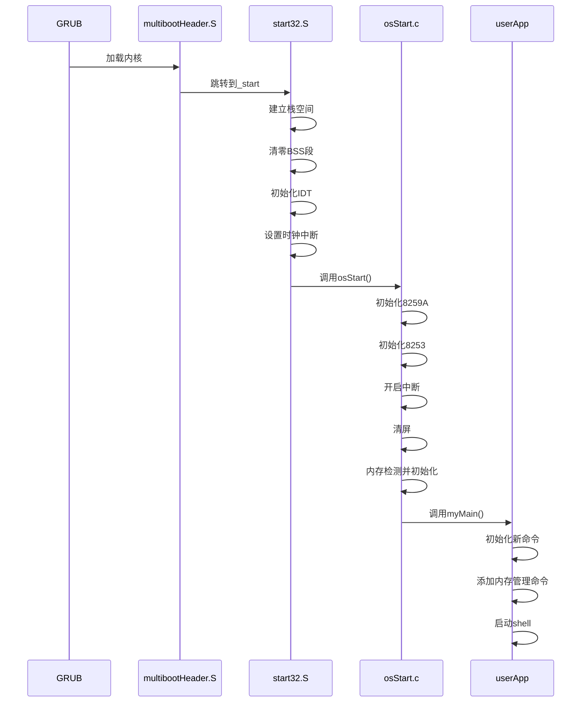

# Lab 4
__PB22030892 刘铠瑜__
## 1. 软件框图及其概述


- 本次实验在 lab3 的基础上，增加了
  - 内存检测程序memTest，等大小内存分区管理算法eFPartition，动态大小内存分区管理算法dPartition，内存管理程序pMemInit。
  - 基于上一层实现的内存相关管理程序，封装malloc/free接口。
  - 用户模块userApp，MyOS通过userInterface.h向其提供接口，基于这些接口实现shell功能。本次新增了命令的动态注册和内存管理相关程序的测试用例。

## 2. 主流程及其实现

- 本次流程在 lab3 的基础上，在 osStart 阶段进行内存检测memTest，之后基于dPartition进行内存初始化pMemInit。
- 在 myMain 阶段，初始化shell，添加相应命令；初始化内存管理算法的测试用例，添加相应的内存检测命令。初始化全部结束后，启动shell。

## 3. 主要功能模块及实现
1. __内存检测算法__
    ```c
    void memTest(unsigned long start, unsigned long grainSize){
        if (start < 0x100000) start = 0x100000;  // 确保起始地址大于1M
        if (grainSize < 0x100) grainSize = 0x100;  // 确保粒度不小于256字节

        unsigned long size = 0;
        int fail = 0;
        while (!fail) {
            unsigned short *grainHead = (unsigned short *)(start + size);
            unsigned short *grainTail = (unsigned short *)(start + size + grainSize - 2);

            // 检查grain头部2字节
            unsigned short oldHead = *grainHead;

            *grainHead = 0xAA55;
            if (*grainHead != 0xAA55) { fail = 1; break; }

            *grainHead = 0x55AA;
            if (*grainHead != 0x55AA) { fail = 1; break; }

            *grainHead = oldHead; // 恢复原值

            // 检查grain尾部2字节
            unsigned short oldTail = *grainTail;

            *grainTail = 0xAA55;
            if (*grainTail != 0xAA55) { fail = 1; break; }

            *grainTail = 0x55AA;
            if (*grainTail != 0x55AA) { fail = 1; break; }

            *grainTail = oldTail; // 恢复原值

            size += grainSize;
        }

        pMemStart = start;
        pMemSize = size;

        myPrintk(0x7,"MemStart: %x  \n", start);
        myPrintk(0x7,"MemSize:  %x  \n", size);
    }
    ```
    核验写入的数据与读出的数据是否一致，即先写后读，如果一致就认为内存可用。不过要注意可能会覆盖原有数据，所以在写之前必须先临时保存。具体过程如下：
   1. 从start开始读出grain的头2个字节
   2. 覆盖写入0xAA55，再读出并检查是否是0xAA55，若不是则检测结束；
    3. 覆盖写入0x55AA，再读出并检查是否是0x55AA，若不是则检测结束；
    4. 写回原来的值
    5. 对grain的尾2个字节，重复2-4
    6. 步进到下一个grain，重复1-5，直到检测结束
2. __等大小分区管理算法__
   ```c
    // 遍历并打印eFPartition结构体和所有空闲块的信息
    void eFPartitionWalkByAddr(unsigned long efpHandler){
        eFPartition *efp = (eFPartition *)efpHandler;
        showeFPartition(efp); // 打印eFPartition结构体信息

        unsigned long current = efp->firstFree; // 从第一个空闲块开始
        while (current != 0) {
            EEB *eeb = (EEB *)current;
            showEEB(eeb); // 打印当前空闲块信息
            current = eeb->next_start; // 跳到下一个空闲块
        }
    }

    // 计算分区实际需要的总空间大小
    unsigned long eFPartitionTotalSize(unsigned long perSize, unsigned long n){
        // 8字节对齐
        unsigned long alignedPerSize = (perSize + 7) & ~0x7;
        // 每个块实际占用 = 用户数据 + EEB头
        unsigned long blockSize = alignedPerSize + EEB_size;
        // 总空间 = n * blockSize + eFPartition结构体大小
        unsigned long totalSize = n * blockSize + eFPartition_size;
        return totalSize;
    }

    // 初始化分区，建立空闲块链表，返回eFPartition结构体首地址
    unsigned long eFPartitionInit(unsigned long start, unsigned long perSize, unsigned long n){
        // 8字节对齐
        unsigned long alignedPerSize = (perSize + 7) & ~0x7;
        unsigned long blockSize = alignedPerSize + EEB_size;

        // 初始化 eFPartition 结构体
        eFPartition *efp = (eFPartition *)start;
        efp->totalN = n; // 总块数
        efp->perSize = alignedPerSize; // 每块大小（对齐后）

        // 初始化第一个空闲块的地址
        unsigned long firstBlock = start + eFPartition_size;
        efp->firstFree = firstBlock;

        // 初始化所有EEB并串成链表
        unsigned long current = firstBlock;
        for (unsigned long i = 0; i < n; i++) {
            EEB *eeb = (EEB *)current;
            if (i == n - 1) {
                eeb->next_start = 0; // 最后一个块，next为0
            } else {
                eeb->next_start = current + blockSize; // 指向下一个块
            }
            current += blockSize;
        }

        // 返回eFPartition结构体首地址（句柄）
        return start;
    }

    // 分配一个空闲块，返回用户数据区首地址
    unsigned long eFPartitionAlloc(unsigned long EFPHandler){
        eFPartition *efp = (eFPartition *)EFPHandler;
        unsigned long freeBlock = efp->firstFree; // 获取第一个空闲块
        if (freeBlock == 0) {	// 如果没有空闲块
            myPrintk(0x7, "eFPartitionAlloc: no free blocks available!\n");
            return 0;
        }
        // 取出第一个空闲块
        EEB *eeb = (EEB *)freeBlock;
        efp->firstFree = eeb->next_start; // 更新链表头

        // 返回用户数据区首地址（跳过EEB头部）
        return freeBlock + EEB_size;
    }

    // 释放一个块，将其插入空闲链表头部
    unsigned long eFPartitionFree(unsigned long EFPHandler,unsigned long mbStart){
        // mbStart 是用户数据区首地址，需要回退到EEB头部
        unsigned long blockAddr = mbStart - EEB_size;
        eFPartition *efp = (eFPartition *)EFPHandler;

        // 将该块插入到空闲链表头部
        EEB *eeb = (EEB *)blockAddr;
        eeb->next_start = efp->firstFree;
        efp->firstFree = blockAddr;

        return 1; // 释放成功
    }
   ```
3. __动态分区管理算法__
    >注：这里我是按照emb的size包括自身来写的，与老师不同但结果是对的
    ```c
    // 初始化动态分区内存管理器
    unsigned long dPartitionInit(unsigned long start, unsigned long totalSize){
        totalSize &= ~0x7; // 8字节对齐

        // 检查空间是否足够
        if (totalSize < dPartition_size + EMB_size) {
            myPrintk(0x7, "dPartitionInit: totalSize too small!\n");
            return 0;
        }

        // 初始化 dPartition 结构体
        dPartition *dp = (dPartition *)start;
        dp->size = totalSize;
        dp->firstFreeStart = start + dPartition_size;

        // 初始化第一个 EMB（空闲块）
        EMB *firstEMB = (EMB *)(start + dPartition_size);
        firstEMB->size = totalSize - dPartition_size; // EMB 占用的总空间
        firstEMB->nextStart = 0; // 目前只有一个空闲块

        // 返回 dPartition 的首地址（句柄）
        return start;
    }

    // 遍历输出所有空闲EMB块信息，便于调试
    void dPartitionWalkByAddr(unsigned long dp){
        showdPartition((struct dPartition *)dp);
        unsigned long current = ((struct dPartition *)dp)->firstFreeStart;
        while (current != 0) {
            struct EMB *emb = (struct EMB *)current;
            showEMB(emb);
            current = emb->nextStart; // 获取下一个空闲块的起始地址
        }
    }

    // 按first fit算法分配空间，返回用户可用空间首地址
    unsigned long dPartitionAllocFirstFit(unsigned long dp, unsigned long size){
        // 8字节对齐
        size = (size + 0x7) & ~0x7;
        // 需要总空间 = 用户数据大小 + 前后隔离带 + EMB结构体大小
        unsigned long needSize = size + 2 * GUARD_SIZE + EMB_size;

        dPartition *dP = (dPartition *)dp;
        unsigned long *prevPtr = &(dP->firstFreeStart);
        unsigned long current = dP->firstFreeStart;

        while (current != 0) {
            EMB *emb = (EMB *)current;
            if (emb->size >= needSize) {
                // 如果剩余空间足够分割出一个新的EMB，则拆分
                if (emb->size >= needSize + EMB_size + 8) {
                    unsigned long nextFree = current + needSize;
                    EMB *newEMB = (EMB *)nextFree;
                    newEMB->size = emb->size - needSize;
                    newEMB->nextStart = emb->nextStart;

                    emb->size = needSize;
                    emb->nextStart = 0;
                    *prevPtr = nextFree;
                } else {
                    // 否则整块分配
                    *prevPtr = emb->nextStart;
                }

                // 写入隔离带
                unsigned char *userPtr = (unsigned char *)emb + EMB_size + GUARD_SIZE;
                *(unsigned int *)((unsigned char *)emb + EMB_size) = GUARD_VALUE; // 前隔离带
                *(unsigned int *)(userPtr + size) = GUARD_VALUE;                  // 后隔离带

                // 返回用户可用空间首地址
                return (unsigned long)userPtr;
            }
            prevPtr = &(emb->nextStart);
            current = emb->nextStart;
        }
        // 没有合适空间
        return 0;
    }

    // 释放空间，合并相邻空闲块，维护空闲链表
    unsigned long dPartitionFreeFirstFit(unsigned long dp, unsigned long start){
        dPartition *dP = (dPartition *)dp;
        unsigned long poolStart = dp + dPartition_size;	 // 可用内存池的起始地址
        unsigned long poolEnd = dp + dP->size;			 // 可用内存池的结束地址

        // 找到EMB头部
        EMB *emb = (EMB *)(start - GUARD_SIZE - EMB_size);

        // 检查释放范围是否合法
        unsigned long embStart = (unsigned long)emb;
        unsigned long embEnd = embStart + emb->size;
        if (embStart < poolStart || embEnd > poolEnd) {
            myPrintk(0x7, "dPartitionFreeFirstFit: free range invalid!\n");
            return 0;
        }

        // 检查隔离带
        unsigned int *frontGuard = (unsigned int *)((unsigned char *)emb + EMB_size);
        unsigned int *rearGuard = 
                     (unsigned int *)(start + (emb->size - EMB_size - 2 * GUARD_SIZE));
        if (*frontGuard != GUARD_VALUE) {
            myPrintk(0x7, "dPartitionFreeFirstFit: front guard corrupted!\n");
            return 0;
        }
        if (*rearGuard != GUARD_VALUE) {
            myPrintk(0x7, "dPartitionFreeFirstFit: rear guard corrupted!\n");
            return 0;
        }

        // 插入空闲链表（按地址有序插入）
        unsigned long *prevPtr = &(dP->firstFreeStart);
        unsigned long current = dP->firstFreeStart;
        while (current != 0 && current < embStart) {
            prevPtr = &(((EMB *)current)->nextStart);
            current = ((EMB *)current)->nextStart;
        }
        emb->nextStart = current;
        *prevPtr = embStart;

        // 合并后面的空闲块
        if (emb->nextStart != 0) {
            EMB *nextEMB = (EMB *)(emb->nextStart);
            if (embStart + emb->size == emb->nextStart) {
                emb->size += nextEMB->size;
                emb->nextStart = nextEMB->nextStart;
            }
        }
        // 合并前面的空闲块
        if (prevPtr != &(dP->firstFreeStart)) {
            // 通过遍历链表找到前一个EMB
            EMB *prevEMB = (EMB *)(dP->firstFreeStart);
            while (prevEMB && prevEMB->nextStart != embStart) {
                prevEMB = (EMB *)(prevEMB->nextStart);
            }
            if (prevEMB && (unsigned long)prevEMB + prevEMB->size == embStart) {
                prevEMB->size += emb->size;
                prevEMB->nextStart = emb->nextStart;
            }
        }
        return 1;
    }
    ```
4. __shell 新增命令注册功能__
    ```c
    void addNewCmd(	unsigned char *cmd, 
            int (*func)(int argc, unsigned char **argv), 
            void (*help_func)(void), 
            unsigned char* description){
        struct cmd *newCmd = (struct cmd *)malloc(cmd_size);
        if (newCmd == NULL) {
            myPrintf(0x7,"addNewCmd: malloc failed\n");
            return;
        }

        // 初始化新命令
        char *ptr = newCmd->cmd;
        while (*cmd) *ptr++ = *cmd++;   // 将命令字符串复制到 cmd 字段
        *ptr = '\0';
        newCmd->func = func;            // 设置命令对应的函数指针
        newCmd->help_func = help_func;  // 设置帮助函数指针
        char *descPtr = newCmd->description;
        while (*description) *descPtr++ = *description++;   // 将描述字符串复制到 description 字段
        *descPtr = '\0';
        newCmd->nextCmd = NULL;         // 初始化下一个命令指针为 NULL

        // 将新命令添加到链表的末尾
        if (ourCmds == NULL) {
            ourCmds = newCmd;  // 如果链表为空，直接设置为新命令
        } else {
            struct cmd *tmpCmd = ourCmds;
            while (tmpCmd->nextCmd != NULL) {
                tmpCmd = tmpCmd->nextCmd;  // 找到链表的最后一个节点
            }
            tmpCmd->nextCmd = newCmd;  // 将新命令添加到链表末尾
        }
    }
    ```

## 4. 源代码说明
   - 目录组织
```
src
├── multibootheader
│   └── multibootHeader.S // mutlibootheader
├── myOS
│   ├── dev
│   │   ├── i8253.c // i8253初始化模块
│   │   ├── i8259A.c // i8259初始化模块
│   │   ├── uart.c // uart输出模块
│   │   └── vga.c // vga输出模块
│   ├── i386
│   │   ├── io.c // 端口io模块
│   │   ├── irq.S // 中断处理相关汇编代码
│   │   ├── irqs.c // 中断处理相关C代码
│   ├── include // 各头文件
│   │   ├── interrupt.h
│   │   ├── io.h
│   │   ├── kmalloc.h
│   │   ├── malloc.h
│   │   ├── mem.h
│   │   ├── myPrintk.h
│   │   ├── string.h
│   │   ├── tick.h
│   │   ├── uart.h
│   │   ├── vga.h
│   │   ├── vsprintf.h
│   │   └── wallClock.h
│   ├── kernel
│   │   ├── mem // 内存相关
│   │   │   ├── dPartition.c // 动态内存分区管理算法
│   │   │   ├── eFPartition.c // 等大小内存分区管理算法
│   │   │   ├── malloc.c // malloc和kmalloc实现
│   │   │   └── pMemInit.c // 内存检测和用户、内核分区初始化
│   │   ├── tick.c // tick模块
│   │   └── wallClock.c // 墙钟模块
│   ├── lib // 自编或移植的库函数
│   │   ├── string.c
│   │   └── vsprintf.c
│   ├── osStart.c // 系统启动过程的C代码
│   ├── printk
│   │   └── myPrintk.c // myPrintk/f模块
│   └── start32.S // 系统启动过程的汇编代码
│   └── userInterface.h // OS提供给用户程序的接口
└── userApp
    ├── main.c // 用户程序入口
    ├── memTestCase.c // 内存管理算法测试用例
    ├── memTestCase.h
    ├── shell.c // shell模块
    └── shell.h
```
   - Makefile 组织
```
src
├── myOS
│   ├── dev
│   ├── i386
│   ├── kernel
│   │   └── mem
│   ├── lib
│   └── printk
└── userApp
```
## 5. 代码布局说明
- **代码段（`.text`）**：
  - **起始地址**：1MB（`0x100000`）
  - **内容**：
    - **Multiboot Header**：位于代码段的最前面，用于引导加载器识别和加载操作系统。
    - **操作系统代码**：包括 `_start` 入口点、`osStart` 和其他功能模块的代码。
  - **对齐方式**：代码段的各个部分对齐到 8 字节边界。

- **数据段（`.data`）**：
  - **起始地址**：紧跟在代码段之后，对齐到 16 字节边界。
  - **内容**：包含已初始化的全局变量和静态变量。

- **BSS 段（`.bss`）**：
  - **起始地址**：紧跟在数据段之后，对齐到 16 字节边界。
  - **内容**：包含未初始化的全局变量和静态变量。
  - **符号**：
    - `__bss_start` 和 `_bss_start`：BSS 段的起始地址。
    - `__bss_end`：BSS 段的结束地址。

- **操作系统的结束地址（`_end`）**：
  - **起始地址**：紧跟在 BSS 段之后，对齐到 16 字节边界。
  - **内容**：表示操作系统代码和数据的结束位置。

## 6. 编译过程说明
__Makefile__
```makefile
SRC_RT=$(shell pwd)

CROSS_COMPILE=
ASM_FLAGS= -m32 --pipe -Wall -fasm -g -O1 -fno-stack-protector	
C_FLAGS =  -m32 -fno-stack-protector -fno-builtin -g

.PHONY: all
all: output/myOS.elf

MULTI_BOOT_HEADER=output/multibootheader/multibootHeader.o
include $(SRC_RT)/myOS/Makefile
include $(SRC_RT)/userApp/Makefile

OS_OBJS       = ${MYOS_OBJS} ${USER_APP_OBJS}

output/myOS.elf: ${OS_OBJS} ${MULTI_BOOT_HEADER}
	${CROSS_COMPILE}ld -n -T myOS/myOS.ld ${MULTI_BOOT_HEADER} ${OS_OBJS} -o output/myOS.elf

output/%.o : %.S
	@mkdir -p $(dir $@)
	@${CROSS_COMPILE}gcc ${ASM_FLAGS} -c -o $@ $<

output/%.o : %.c
	@mkdir -p $(dir $@)
	@${CROSS_COMPILE}gcc ${C_FLAGS} -c -o $@ $<

clean:
	rm -rf output

```
- 先递归编译所有C和汇编源文件为.o目标文件，再用链接器将所有目标文件和multiboot头文件链接成最终的ELF可执行文件

## 7. 运行和运行结果说明
1. __运行__
   在源码目录下输入一下指令
   ```
    ./source2run.sh
   ```
   然后在输入
   ```
    sudo screen /dev/pts/x
   ```
2. __运行结果说明__

   - 命令注册
    
    可见命令注册成功

   - `testMalloc1`、`testMalloc2` 和 `maxMallocSizeNow`
    
    `testMalloc1`、`testMalloc2` 正确输出， `maxMallocSizeNow` 的值保持不变，符合预期
    - `testdp1`
    
    这里申请了一个大小为0x100的块创建新的内存管理句柄，考虑到实际上有dPartition和EMB占用空间，所以最多使用0xf0个字节。因此前三个可以成功申请，最后一个不行
    - `testdp2`
    
    可以看到在释放过程中，空闲块可以正常合并，符合预期
    - `testdp3`
    
    可以看到可用内存变化、分配内存句柄和分配内存大小一一对应
    - `testeFP`
    
    先malloc请求一块0x8c大小的内存块，用eFPartitionInit初始化为合适大小，划分为4个块。之后用eFPartitionAlloc请求分配五次，前四次A、B、C、D都成功，最后一次E失败，符合预期。然后分别释放A、B、C、D块，可以看到回收正常。