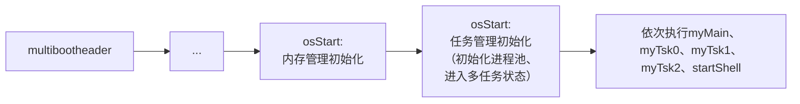

# Lab 5
> 延迟提交一周

## 软件框图及其概述

在 Lab 4 代码的基础上，增加了：
- 汇编代码实现上下文切换
- 实现了任务管理和 FCFS 调度模块
  
## 主流程及其实现

- 从 `multibootheader` 到 `osStart: 内存管理初始化` 与之前实验相同，在此不再赘述
- 然后进行任务管理初始化
  - 初始化进程池
  - 创建 idle 任务
  - 创建 init 任务（myMain），将其加入就绪队列
  - 进入多任务状态
- 执行 myMain，在 myMain 依次创建 tsk0、tsk1、tsk2、shellTsk，并加入就绪队列
- myMain 执行结束后，继续FCFS调度，按照插入的顺序执行上述任务，直至全部执行完，切换至idleTsk。


## 主要模块及其实现
1. __上下文切换__
   - __CTX_SW 函数__
        ```s
        .global CTX_SW
        CTX_SW:  
            pushf
            pusha

            movl prevTSK_StackPtr, %eax
            movl %esp, (%eax)
            movl nextTSK_StackPtr, %esp

            popa 
            popf
            ret
        ```
        - `pushf` 和 `pusha` 分别保存了当前任务的EFLAGS寄存器和所有通用寄存器到栈上，从而保存了当前任务的完整CPU执行现场
        - `movl prevTSK_StackPtr, %eax` 和 `movl %esp, (%eax)` 把当前的ESP（栈顶指针）保存到当前任务的TCB中，记录当前任务的栈顶
        - `movl nextTSK_StackPtr, %esp` 加载下一个任务的栈顶指针到ESP，切换到下一个任务的栈
        - `popa` 和 `popf` 恢复下一个任务的所有通用寄存器和EFLAGS寄存器
        - `ret` 返回到下一个任务的执行点，完成上下文切换。

    - __stack_init 函数__ <a id="stack_init"></a>
        ```c
        void stack_init(unsigned long **stk, void (*task)(void)){
            *(*stk)-- = (unsigned long) 0x08;       //高地址
            *(*stk)-- = (unsigned long) task;       //EIP
            *(*stk)-- = (unsigned long) 0x0202;     //FLAG寄存器

            *(*stk)-- = (unsigned long) 0xAAAAAAAA; //EAX
            *(*stk)-- = (unsigned long) 0xCCCCCCCC; //ECX
            *(*stk)-- = (unsigned long) 0xDDDDDDDD; //EDX
            *(*stk)-- = (unsigned long) 0xBBBBBBBB; //EBX

            *(*stk)-- = (unsigned long) 0x44444444; //ESP
            *(*stk)-- = (unsigned long) 0x55555555; //EBP
            *(*stk)-- = (unsigned long) 0x66666666; //ESI
            *(*stk)   = (unsigned long) 0x77777777; //EDI
        }
        ```
        - `stack_init` 函数的主要作用是初始化任务切换时的栈帧内容，为操作系统的上下文切换做好准备
        - 这些值的顺序和 `pusha`、`pushf` 等指令的出栈顺序保持一致，这样在任务切换时恢复寄存器（`popa`、`popf`）不会出错
        - `0x08`：代码段选择子（CS），用于保证任务能在正确的代码段运行。
        - `task`：任务入口地址（EIP），保证任务能从头开始执行。
        - `0x0202`：EFLAGS，设置中断允许等初始CPU状态。
        - 其余：单纯用于填充寄存器，调试方便，无特殊业务功能。
    - __context_switch函数__
        ```c
        void context_switch(myTCB *prevTsk, myTCB *nextTsk) {
            prevTSK_StackPtr = &(prevTsk->stkTop);
            currentTsk = nextTsk;
            nextTSK_StackPtr = nextTsk->stkTop;
            CTX_SW(prevTSK_StackPtr,nextTSK_StackPtr);
        }
        ```
        - 将 `CTX_SW` 进行封装

2. __任务控制块 TCB__
    - __TCB 结构体__
        ```c
        typedef struct myTCB {
            unsigned long *stkTop;        /* 栈顶指针 */
            unsigned long stack[STACK_SIZE];      /* 开辟了一个大小为STACK_SIZE的栈空间 */  
            unsigned long TSK_State;   /* 进程状态 */
            unsigned long TSK_ID;      /* 进程ID */ 
            void (*task_entrance)(void);  /*进程的入口地址*/
            struct myTCB * nextTCB;           /*下一个TCB*/
        } myTCB;
        ```
        - `stkTop` 栈顶指针，用于实现上下文切换
        - `stack` TCB 的栈空间，其中 `STACK_SIZE` 指定了栈的大小
        - `TSK_ID` 任务的 id
        - `TSK_State` 任务状态，包括以下 4 种（但其实本次实验只用到了 2 种）
            ```c
            #define TSK_RDY 0        //表示当前进程已经进入就绪队列中
            #define TSK_WAIT -1      //表示当前进程还未进入就绪队列中
            #define TSK_RUNING 1     //表示当前进程正在运行
            #define TSK_NONE 2       //表示进程池中的TCB为空未进行分配
            ```
        - `*task_entrance` 函数入口
        - `nextTCB` 下一个任务地址，用于就绪队列链表和空闲队列链表
     - __操作相关__
        ```c
        void tskStart(myTCB *tsk){
            tsk->TSK_State = TSK_RDY;
            tskEnqueueFCFS(tsk);
        }
        ```
        - 将一个在进程池中的TCB设置为就绪状态，并将其加入到就绪队列中
        ```c
        void tskEnd(void){
            tskDequeueFCFS(currentTsk);
            destroyTsk(currentTsk->TSK_ID);
            schedule();
        }
        ```
        - 任务结束：将一个在就绪队列中的TCB移除就绪队列，进程池中对应的TCB也删除，TCB结束后，我们需要进行一次调度
        
        ```c
        //在进程池中创建一个进程，并把该进程加入到rqFCFS队列中
        int createTsk(void (*tskBody)(void)){
            if (firstFreeTsk == NULL) {        //没有空闲的TCB可用
                myPrintk(0x2, "No free TCB available.\n");
                return -1; 
            }
            
            myTCB *newTsk = firstFreeTsk;      //获取下一个空闲的TCB
            firstFreeTsk = newTsk->nextTCB;    //更新下一个空闲的TCB

            newTsk->task_entrance = tskBody;   //设置任务入口地址
            stack_init(&(newTsk->stkTop), tskBody); //初始化栈空间
            tskStart(newTsk); //将新创建的任务加入到就绪队列中
            
            return newTsk->TSK_ID; //返回新创建任务的ID
        }
        ```
        - 以tskBody为参数在进程池中创建一个进程，并调用tskStart函数，将其加入就绪队列
        ```c
        //在进程中寻找TSK_ID为takIndex的进程，并销毁该进程
        void destroyTsk(int takIndex) 
            if (takIndex < 0 || takIndex >= TASK_NUM) {
                myPrintk(0x2, "Invalid task index: %d\n", takIndex);
                return; //无效的任务索引
            }
            
            myTCB *tsk = &tcbPool[takIndex]; //获取对应的TCB
            if (tsk->TSK_State == TSK_NONE) {
                myPrintk(0x2, "Task %d is not allocated.\n", takIndex);
                return; //任务未分配，无法销毁
            }

            tsk->TSK_State = TSK_NONE; //将状态设置为未分配
            tsk->nextTCB = firstFreeTsk; //将该TCB加入到空闲链表中
            firstFreeTsk = tsk; //更新下一个空闲的TCB指针
        }
        ```
        - 销毁进程，将其状态设置为 TSK_NONE，并将其加入到空闲链表中
 
3. __就绪队列__ 
   - __就绪队列结构体__
       ```c
       typedef struct rdyQueueFCFS{
           myTCB * head;       //就绪队列的头结点
           myTCB * tail;       //就绪队列的尾结点
           myTCB * idleTsk;    //空闲任务
       } rdyQueueFCFS;
       ```

       - 与普通队列不同的是多加了一个 `idleTsk` 数据，用于队列空时，转到空闲任务
    
   - __相关操作__
       ```c
       void rqFCFSInit(myTCB* idleTsk);
       int rqFCFSIsEmpty(void);
       myTCB * nextFCFSTsk(void);
       void tskEnqueueFCFS(myTCB *tsk);
       void tskDequeueFCFS(myTCB *tsk);
       ```   
       - 与一般队列没什么区别，注意多了一个 `idleTsk`

## 源代码说明
- __目录组织__
    ```
    src
    ├── multibootheader
    │   └── multibootHeader.S
    ├── myOS
    │   ├── dev
    │   │   ├── i8253.c
    │   │   ├── i8259A.c
    │   │   ├── uart.c
    │   │   └── vga.c
    │   ├── i386
    │   │   ├── CTX_SW.S
    │   │   ├── io.c
    │   │   ├── irq.S
    │   │   ├── irqs.c
    │   ├── include
    │   │   ├── i8253.h
    │   │   ├── i8259.h
    │   │   ├── io.h
    │   │   ├── irq.h
    │   │   ├── kmalloc.h
    │   │   ├── malloc.h
    │   │   ├── mem.h
    │   │   ├── myPrintk.h
    │   │   ├── string.h
    │   │   ├── task.h
    │   │   ├── uart.h
    │   │   ├── vga.h
    │   │   ├── vsprintf.h
    │   │   └── wallClock.h
    │   ├── kernel
    │   │   ├── mem
    │   │   │   ├── dPartition.c 
    │   │   │   ├── eFPartition.c 
    │   │   │   ├── malloc.c
    │   │   │   └── pMemInit.c 
    │   │   ├── task.c
    │   │   ├── tick.c
    │   │   └── wallClock.c
    │   ├── lib
    │   │   └── string.c
    │   ├── osStart.c
    │   ├── printk
    │   │   ├── vsprintf.c
    │   │   ├── types.h
    │   │   └── myPrintk.c 
    │   └── start32.S
    │   └── userInterface.h
    └── userApp
        ├── main.c
        ├── memTestCase.c
        ├── memTestCase.h
        ├── shell.c
        ├── shell.h
        ├── userApp.h
        └── userTasks.c
    ```
- Makefile 组织
    ```
    src
    ├── myOS
    │   ├── dev
    │   ├── i386
    │   ├── kernel
    │   │   └── mem
    │   ├── lib
    │   └── printk
    └── userApp
    ```
## 代码布局说明
- **代码段（`.text`）**：
  - **起始地址**：1MB（`0x100000`）
  - **内容**：
    - **Multiboot Header**：位于代码段的最前面，用于引导加载器识别和加载操作系统。
    - **操作系统代码**：包括 `_start` 入口点、`osStart` 和其他功能模块的代码。
  - **对齐方式**：代码段的各个部分对齐到 8 字节边界。

- **数据段（`.data`）**：
  - **起始地址**：紧跟在代码段之后，对齐到 16 字节边界。
  - **内容**：包含已初始化的全局变量和静态变量。

- **BSS 段（`.bss`）**：
  - **起始地址**：紧跟在数据段之后，对齐到 16 字节边界。
  - **内容**：包含未初始化的全局变量和静态变量。
  - **符号**：
    - `__bss_start` 和 `_bss_start`：BSS 段的起始地址。
    - `__bss_end`：BSS 段的结束地址。

- **操作系统的结束地址（`_end`）**：
  - **起始地址**：紧跟在 BSS 段之后，对齐到 16 字节边界。
  - **内容**：表示操作系统代码和数据的结束位置。

## 编译过程说明
__Makefile__
```makefile
SRC_RT=$(shell pwd)

CROSS_COMPILE=
ASM_FLAGS= -m32 --pipe -Wall -fasm -g -O1 -fno-stack-protector	
C_FLAGS =  -m32 -fno-stack-protector -fno-builtin -g

.PHONY: all
all: output/myOS.elf

MULTI_BOOT_HEADER=output/multibootheader/multibootHeader.o
include $(SRC_RT)/myOS/Makefile
include $(SRC_RT)/userApp/Makefile

OS_OBJS       = ${MYOS_OBJS} ${USER_APP_OBJS}

output/myOS.elf: ${OS_OBJS} ${MULTI_BOOT_HEADER}
	${CROSS_COMPILE}ld -n -T myOS/myOS.ld ${MULTI_BOOT_HEADER} ${OS_OBJS} -o output/myOS.elf

output/%.o : %.S
	@mkdir -p $(dir $@)
	@${CROSS_COMPILE}gcc ${ASM_FLAGS} -c -o $@ $<

output/%.o : %.c
	@mkdir -p $(dir $@)
	@${CROSS_COMPILE}gcc ${C_FLAGS} -c -o $@ $<

clean:
	rm -rf output

```
- 先递归编译所有C和汇编源文件为.o目标文件，再用链接器将所有目标文件和multiboot头文件链接成最终的ELF可执行文件

## 运行和运行结果说明
1. __运行__
   在源码目录下输入一下指令
   ```
    ./source2img.sh
   ```
   然后在输入
   ```
    sudo screen /dev/pts/x
   ```
2. __运行结果说明__
    
    - myMain、myTsk0、myTsk1、myTsk2、startShell 依次正确执行

## 思考题
1. 在上下文切换的现场维护中，pushf 和 popf 对应，pusha 和 popa 对应，call 和 ret 对应，但是为什么 CTS SW 函数中只有 ret 而没有 call 呢？
    - 因为在调用该函数前，调用者（caller）已经保存了返回地址，子函数不必再保存了

2. 谈一谈你对 stack init 函数的理解
   - [如前所述](#stack_init)
3. myTCB 结构体定义中的 stack[STACK SIZE] 的作用是什么？BspContextBase[STACK SIZE] 的作用又是什么？
    - myTCB::stack[STACK_SIZE]：每个任务自己的私有栈空间，任务切换后用于保存/恢复本任务的运行环境。
    - BspContextBase[STACK_SIZE]：引导/主控流程专用的栈空间，用于首次进入多任务调度时保存主控现场，保证上下文切换机制完整。
4. prevTSK_ StackPtr 是一级指针还是二级指针？为什么？
   - 二级
   - 在 CTX_SW 汇编代码中，需要将当前任务的 ESP（栈顶指针）写回对应 TCB 的 stkTop 字段，以便下次切换回来时能从同样的现场恢复。stkTop 本身是一个指针，为了修改其值，必须使用该指针的指针。